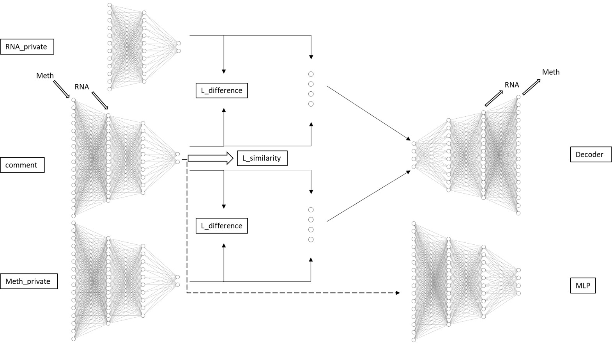

# Cross-modal-Label-Transfer-from-RNA-to-Methylation

This repository presents a cross-modal label transfer framework that transfers cell-type annotations from RNA data to methylation data. To achieve this, we designed a model that integrates a Variational Autoencoder (VAE) with a Multi-Layer Perceptron (MLP) classifier.

The model uses two modality-specific VAEs to encode and decode RNA and methylation data independently. A classifier is introduced in the shared latent space to predict cell types, enabling joint training of reconstruction and classification tasks.

To improve cross-modal alignment, the framework incorporates the idea of shared-private representation disentanglement. It extracts both modality-invariant and modality-specific features to enhance the clarity and consistency of the latent space. Then, a K-Nearest Neighbors (KNN) algorithm is applied in the shared latent space to score RNA samples and select high-confidence pseudo-labeled methylation samples for iterative training.

## Model Architecture

